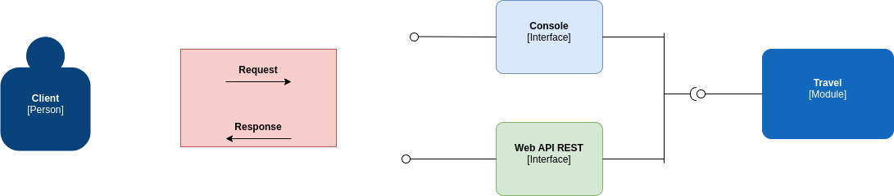

# Travel Route
_________________________________

## Problema
É desejado por parte dos clientes viajar pagando o mínimo possível, independente de quantas conexões forem necessárias. 
 
Para isso o cliente irá utilizar uma aplicação para saber qual o melhor itinerário de sua origem ao destino desejado.
 
Nessa versão inicial da aplicação, o mapa de rotas estará disponível em um arquivo de texto organizado como CSV, sendo isso a entrega inicial para funcionamento da aplicação.


### Exemple

```csv
GRU,BRC,10
BRC,SCL,5
GRU,CDG,75
GRU,SCL,20
GRU,ORL,56
ORL,CDG,5
SCL,ORL,20
```

### Explicando
Caso desejemos viajar de **GRU** para **CDG** existem as seguintes rotas:

1. GRU - BRC - SCL - ORL - CDG ao custo de **$40**
2. GRU - ORL - CGD ao custo de **$64**
3. GRU - CDG ao custo de **$75**
4. GRU - SCL - ORL - CDG ao custo de **$45**

O melhor preço da rota **1** logo, o output da consulta deve ser **GRU - BRC - SCL - ORL - CDG**.

### A aplicação
Para a primeira versão da aplicação deverá implementar duas interfaces com as seguintes funcionalidades:

#### Interface console:
Rceber um input com a rota no formato "DE-PARA" e imprimir a melhor rota e seu respectivo valor.

Exemplo:
  
```shell
please enter the route: GRU-CGD
best route: GRU - BRC - SCL - ORL - CDG > $40
please enter the route: BRC-CDG
best route: BRC - ORL > $30
```

#### Interface Web API REST:
- Registro de novas rotas. Essas novas rotas devem ser persistidas no arquivo csv utilizado como input(input-routes.csv),
- Consulta de melhor rota entre dois pontos.

_________________________________________________________________

## Solução
O domínio da aplicação gire em torno do mapa de rotas, onde é estruturado como um grafo adjacente ponderado direcionado, representado através de uma lista adjacente. 
 
Tendo o mapa de rotas em memória, optei por um algoritmo Depth-first search (Busca em profundidade), onde busca todas as rotas que atendam o destino e informa o melhor itinerário, sendo o mais barato. 
 
Além disso é possível adicionar novas rotas, tanto em memória no mapa de rotas já carregado, quanto em um sua fonte, o arquivo CSV. 
 
Para isso foi organizado e encapsulado em pacotes e componentes bem definidos.

### Design



Basicamente foi projetado com que o domínio estivesse representado em módulos com baixo acoplamento e com a exposição de suas funcionalidades através de uma api bem definidos, onde expressaria sua assinatura e dependências para que os demais pudessem consumir e minimizar a exposição e conhecimento de partes internas do módulo. 
 
A ideia base era aproveitar de conceitos de um design arquitetural hexagonal/ports and adapters, mas pela simplicidade da aplicação, não achei necessário se aprofundar tanto. 
 
Logo a aplicação tem como requisito ter duas interfaces com usuário, que seriam as portas de entrada, tanto console, quanto uma web API REST, para isso é utilizado a api definida no módulo como adaptador para integrar e expor as funcionalidades para os usuários através destas interfaces. 
 
A implementação de cada interface apenas tem como necessidade implementar e atender a assinatura definida pela api do módulo e expor isso conforme sua natureza, onde a web API REST define handlers(controllers, etc...) correspondentes para cada funcionalidade através da api do módulo e organiza e estrutura os recursos através de uma configuração de roteamento. 
 
Da mesma forma só que mais simplista, o console tem handler único e padrão, que ao entrar em execução, realiza a mesma operação conforme a interação do usuário. 
 
Como o módulo tem certas dependências para sua funcionalidade, foi criado um componente que define essas dependências e a encapsula, no startup da aplicação é necessário que inicialize esse componente com as dependências necessárias e repasse para as interfaces conseguirem resolver as dependências de cada api. 
 
Claro que em um escopo diferente, real e maior, no lugar poderia ter uma abordagem utilizando um container de dependências, que foi onde me inspirei. 
 
Ao iniciar a aplicação as duas interfaces estão em pleno funcionamento, como fazem parte da mesma aplicação(processo) em execução, quando encerrado as duas interfaces ficam indisponíveis.


A estrutura do projeto gira principalmente em torno dos seguintes componentes:

- [Travel](pkg/travel): O módulo onde está implementado e expresso a regra de negócio, como se fosse um simples domínio.
- [Source](pkg/data/source): As formas de acessar e manipular as fontes de dados disponíveis, no caso atualmente somente arquivos csv em um determinado padrão e regras, sendo um dos nosso adapters.
- [Console](pkg/console): A interface de usuário a partir de um console, onde apenas provê a funcionalidade de consulta das melhores rotas, sendo uma das nossas duas portas primárias. 
- [Webapi](pkg/webapi): A última interface com o usuário, só que a partir de uma web api rest, onde provê além da consulta a funcionalidade de registrar novas rotas, sendo nossa última porta primária.

#### O que poderia ser feito e melhorado: 
- Talvez poderia haver um value object Price. 
- Talvez RoutesMap poderia ser um agregado e as operações estariam centralizados nele. 
- Projetar um algoritmo mais inteligente/performático em sua busca e eficiente no uso dos recursos.
- Toda vez que uma nova rota fosse registrada, bloqueasse todas consultas até que fosse finalizado. 
- Melhorar as respostas da webapi.
- Repensar totalmente a interface console, por estar ruim na manutenibilidade e legibilidade. 
- Abstrair mais as extremidades da api do módulo.

### Como executar

```
go get -v -d ./...

go build -a -o travel-route ./cmd/travel-route/main.go

./travel-route routes-map.csv
```


### API REST
<details><summary>Consultar a melhor rota</summary>
<p>

```
Endpoint: /travel/consult-better-itinerary
HTTP verb: GET
Not payload
Query string: ?origin=GRU&destination=CDG
```
</p>
</details>

<details><summary>Registrar nova rota</summary>
<p>

```
Endpoint: /travel/register-new-route
Http verb: POST
Not query string parameters
Payload sample:
{
	"origin": "BRA",
	"destination": "EUA",
	"price": 100
}
```
</p>
</details>